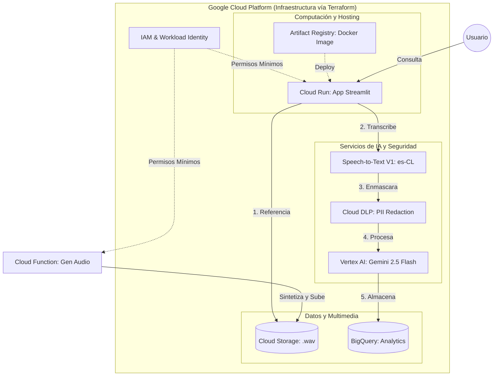

# 🎙️ Speech Analytics — Banca GCP

> **Contexto:** Este proyecto es una demostración técnica desarrollada para una postulación al cargo de **Ingeniero de IA**, en una iniciativa donde el equipo procesa grabaciones de llamadas de call centers para extraer analítica de negocio y almacenarla en BigQuery, utilizando exclusivamente los servicios nativos de **Google Cloud Platform**.

---

## 🎯 ¿De qué trata este proyecto?

Los call centers bancarios generan cientos de grabaciones de voz al día. Analizar esas llamadas manualmente es inviable: consume tiempo, es costoso y no escala. Este proyecto demuestra cómo **automatizar completamente ese proceso** con inteligencia artificial en la nube.

### El problema que resuelve

> Un supervisor de calidad necesita saber: ¿Qué quería el cliente? ¿Cómo quedó su experiencia? ¿Está en riesgo de abandonar el banco? ¿Se expusieron datos sensibles durante la llamada?

Responder esas preguntas manualmente para 500 llamadas diarias es imposible. Esta solución lo hace **en menos de 30 segundos por llamada**, de forma completamente automatizada.

### La solución: un pipeline de IA end-to-end

El sistema toma un archivo de audio `.wav` y ejecuta una cadena de 5 servicios GCP en secuencia:

```
Audio  →  Transcripción  →  Censura PII  →  Insights IA  →  BigQuery  →  Dashboard
```

1. **Transcripción automática** con separación de voces (¿quién dijo qué? Agente vs Cliente)
2. **Enmascaramiento de datos sensibles**: RUTs, tarjetas de crédito y correos son censurados antes de salir del pipeline
3. **Análisis semántico con Gemini**: el modelo LLM extrae intención, sentimiento, riesgo de churn y un resumen estructurado
4. **Persistencia en BigQuery**: cada llamada queda registrada con sus métricas, lista para explotación con herramientas BI
5. **Dashboard interactivo en Streamlit** desplegado en Cloud Run: permite seleccionar, reproducir y analizar cualquier llamada en tiempo real

### ¿Qué habilidades demuestra este proyecto?

| Área | Habilidades demostradas |
|---|---|
| **Python** | Arquitectura modular, manejo de APIs, procesamiento de audio, control de errores robusto |
| **IA / LLM** | Integración con Vertex AI (Gemini 2.5 Flash), prompt engineering, parsing de JSON estructurado |
| **GCP** | Cloud Run, Speech-to-Text V1, Cloud DLP, BigQuery, Cloud Storage, Cloud Functions, Artifact Registry |
| **Seguridad de datos** | Enmascaramiento de PII con detectores nativos + regex personalizado para RUT chileno |
| **Infraestructura como Código** | Terraform para aprovisionar todos los recursos GCP desde cero |
| **Frontend** | Streamlit con diseño moderno, dark mode, chat bubbles por hablante y visualización de hallazgos PII |


### ⏱️ Alcance y honestidad técnica

Este MVP fue construido en **una tarde de trabajo** como demostración técnica rápida. El objetivo fue demostrar la capacidad de integrar múltiples servicios de GCP en un pipeline funcional end-to-end partiendo desde cero, sin plantillas ni boilerplates previos.

**El sistema funciona y es demostrable**, pero como todo MVP tiene espacio claro para escalar y optimizar:

- **Procesamiento en lote**: actualmente procesa un audio a la vez; podría extenderse con Pub/Sub + Cloud Run Jobs para procesar cientos de llamadas en paralelo de forma asíncrona.
- **Webhooks en tiempo real**: en lugar de subir un `.wav` manualmente, conectar directamente con la plataforma telefónica usando SIPREC o similares.
- **Dashboard BI**: los datos ya están en BigQuery listos para conectar con Looker Studio o Grafana para visualizaciones ejecutivas.
- **Modelos de detección de PII**: el regex actual cubre el formato estándar del RUT chileno; podría entrenarse un modelo custom con AutoML para mayor cobertura.
- **Evaluación de calidad**: agregar métricas de adherencia al protocolo del agente (¿saludó correctamente? ¿ofreció solución alternativa?) usando prompts más detallados en Gemini.
- **Autenticación**: el demo es público (`--allow-unauthenticated`); en producción se conectaría con IAP o un proveedor de identidad corporativo.

---

## 🏗️ Arquitectura



**Servicios GCP utilizados:**

| Servicio | Rol en el proyecto |
|---|---|
| **Cloud Run** | Hosting de la app Streamlit (contenedor Docker) |
| **Cloud Storage** | Repositorio de archivos de audio `.wav` |
| **Speech-to-Text V1** | Transcripción con diarización de hablantes en `es-CL` |
| **Cloud DLP** | Detección y enmascaramiento de PII con regex customizado para RUT chileno |
| **Vertex AI (Gemini 2.5 Flash)** | Extracción de intención, sentimiento, churn y resumen |
| **BigQuery** | Almacén analítico particionado por mes |
| **Artifact Registry** | Repositorio Docker para la imagen del servicio |
| **Cloud Functions** | Generación serverless de los 5 audios de muestra |

---

## 🗄️ Esquema de Datos BigQuery

Tabla: `call_analytics_dataset.call_transcriptions` (particionada por mes en `created_at`)

| Columna | Tipo | Descripción |
|---|---|---|
| `call_id` | STRING (REQUIRED) | UUID único generado por el pipeline |
| `timestamp` | TIMESTAMP (REQUIRED) | Momento de procesamiento |
| `audio_filename` | STRING | Nombre del archivo de audio procesado |
| `transcript_redacted` | STRING | Transcripción completa con PII enmascarada |
| `call_intent` | STRING | Intención detectada por Gemini |
| `customer_sentiment` | STRING | Positivo, Neutro o Negativo |
| `churn_risk` | BOOL | Riesgo de abandono detectado |
| `summary` | STRING | Resumen de 2-3 oraciones generado por Gemini |
| `processing_duration_seconds` | FLOAT | Duración total del pipeline |
| `speech_confidence_score` | FLOAT | Score de confianza STT (0.0–1.0) |
| `dlp_findings_count` | INTEGER | Cantidad de hallazgos PII censurados |
| `gemini_model_used` | STRING | Modelo Gemini utilizado |
| `pipeline_status` | STRING | SUCCESS o PARTIAL_FAILURE |
| `created_at` | TIMESTAMP (REQUIRED) | Timestamp de inserción (campo de partición) |
| `updated_at` | TIMESTAMP | Timestamp de última actualización |

---

## 📋 Prerrequisitos

- [gcloud CLI](https://cloud.google.com/sdk/docs/install) instalado y autenticado
- [Terraform](https://developer.hashicorp.com/terraform/downloads) >= 1.5
- [Docker](https://www.docker.com/) instalado
- Python 3.10+
- Proyecto GCP con **billing habilitado**

---

## ⚡ APIs de GCP a Habilitar

```bash
gcloud services enable \
  speech.googleapis.com \
  dlp.googleapis.com \
  aiplatform.googleapis.com \
  bigquery.googleapis.com \
  storage.googleapis.com \
  run.googleapis.com \
  artifactregistry.googleapis.com \
  iam.googleapis.com \
  texttospeech.googleapis.com \
  cloudfunctions.googleapis.com \
  cloudbuild.googleapis.com
```

---

## 🚀 Despliegue Paso a Paso

### 1. Autenticación

```bash
gcloud auth application-default login
gcloud config set project gcp-speech-analytics
```

### 2. Habilitar APIs

```bash
gcloud services enable \
  speech.googleapis.com dlp.googleapis.com aiplatform.googleapis.com \
  bigquery.googleapis.com storage.googleapis.com run.googleapis.com \
  artifactregistry.googleapis.com iam.googleapis.com texttospeech.googleapis.com \
  cloudfunctions.googleapis.com cloudbuild.googleapis.com
```

### 3. Infraestructura con Terraform

```bash
cd terraform
terraform init
terraform apply -var="project_id=gcp-speech-analytics"
```

### 4. Generar Audios de Muestra

> [!NOTE]
> **Opción recomendada (Cloud Function):** Al ejecutar Terraform, se provisionó automáticamente una Cloud Function serverless. Solo invoca su URL para depositar los 5 `.wav` directamente en tu bucket.

```bash
cd terraform
curl $(terraform output -raw cloud_function_url)
cd ..
```

**Opción alternativa (local):**
```bash
python sample_audios/generate_sample_audios.py
```

### 5. Ejecutar Localmente

```bash
# Requeridas (sin valor por defecto)
export GCP_PROJECT_ID=<tu-proyecto>
export GCS_BUCKET_NAME=<tu-bucket>

# Opcionales (usan defaults seguros)
export BQ_DATASET_ID=call_analytics_dataset
export BQ_TABLE_ID=call_transcriptions
export GEMINI_MODEL=gemini-2.5-flash

cd src
streamlit run app.py
# Abrir http://localhost:8501
```

### 6. Build y Push de la Imagen Docker

> [!IMPORTANT]
> Ejecuta desde la **raíz del proyecto**, no desde `src/` ni `terraform/`.

```bash
# Configurar Docker para Artifact Registry
gcloud auth configure-docker us-central1-docker.pkg.dev

# Build (forzar sin caché para asegurar últimos cambios)
docker build --no-cache \
  -t us-central1-docker.pkg.dev/gcp-speech-analytics/speech-analytics-repo/speech-analytics-app:latest \
  -f src/Dockerfile .

# Push
docker push us-central1-docker.pkg.dev/gcp-speech-analytics/speech-analytics-repo/speech-analytics-app:latest
```

### 7. Deploy en Cloud Run

```bash
gcloud run deploy speech-analytics-app \
  --image us-central1-docker.pkg.dev/gcp-speech-analytics/speech-analytics-repo/speech-analytics-app:latest \
  --region us-central1 \
  --platform managed \
  --allow-unauthenticated \
  --service-account speech-analytics-sa@gcp-speech-analytics.iam.gserviceaccount.com \
  --set-env-vars GCP_PROJECT_ID=gcp-speech-analytics,GCS_BUCKET_NAME=speech-analytics-gcp-speech-analytics,BQ_DATASET_ID=call_analytics_dataset,BQ_TABLE_ID=call_transcriptions,GEMINI_MODEL=gemini-2.5-flash \
  --memory 2Gi \
  --cpu 2 \
  --port 8080
```

---

## 🔧 Variables de Entorno

| Variable | Descripción | Valor por defecto |
|---|---|---|
| `GCP_PROJECT_ID` | ID del proyecto GCP | `gcp-speech-analytics` |
| `GCS_BUCKET_NAME` | Bucket GCS para audios | `speech-analytics-gcp-speech-analytics` |
| `BQ_DATASET_ID` | Dataset de BigQuery | `call_analytics_dataset` |
| `BQ_TABLE_ID` | Tabla de BigQuery | `call_transcriptions` |
| `GEMINI_MODEL` | Modelo Gemini a utilizar | `gemini-2.5-flash` |

---

## 📁 Estructura del Proyecto

```
/
├── terraform/
│   ├── main.tf          # GCS, BQ, Artifact Registry, SA, IAM, Cloud Run, Cloud Function
│   └── variables.tf     # Variables con defaults
├── src/
│   ├── app.py           # Interfaz Streamlit con introducción, transcripción censurable y panel de insights
│   ├── gcp_services.py  # STT V1 (telephony/es-CL), DLP (regex RUT), Gemini 2.5 Flash
│   ├── bq_client.py     # Insert y consulta Top 10 en BigQuery
│   └── Dockerfile       # Imagen python:3.10-slim, puerto 8080
├── cloud_function/
│   └── main.py          # Cloud Function: genera 5 audios TTS y los sube a GCS
├── sample_audios/
│   └── generate_sample_audios.py  # Script local alternativo (TTS 5 escenarios bancarios)
├── .gitignore
├── README.md
└── requirements.txt
```

---

## 🎯 Escenarios de Llamadas de Muestra

| Archivo | Escenario | Sentimiento Esperado | Churn Risk |
|---|---|---|---|
| `Llamada_01_ReclamoFraude.wav` | Cliente reporta cargo no reconocido | Negativo | ✅ Sí |
| `Llamada_02_ConsultaSaldo.wav` | Consulta de saldo y cartola | Neutro | ❌ No |
| `Llamada_03_SolicitudPrestamo.wav` | Solicitud de crédito de consumo | Positivo | ❌ No |
| `Llamada_04_BloqueoTarjeta.wav` | Bloqueo urgente por robo | Negativo | ❌ No |
| `Llamada_05_CancelacionCuenta.wav` | Cierre de cuenta por comisiones | Negativo | ✅ Sí |


